# Groupe n10
**-ANGO MBA Melchior Junior**
**-DOSSE Kovi Amen**
**-MAVIOGA Jude Tangui**
**-SOUNGANY-IGALO Daryl Junior**

# System Metrics Agent — Conteneurisation, Orchestration et Pipeline CI/CD

> **Master — Éléments du DevOps** · Travail Pratique individuel
> Application : `system_metrics_agent` (Python / FastAPI / psutil)
> Compétences : Docker, Docker Compose, GitHub Actions, Docker Hub, CI/CD

Ce projet conteneurise un agent Python de collecte de métriques système (CPU, mémoire, charge), l'orchestre avec Docker Compose et l'intègre dans un pipeline GitHub Actions qui **construit, teste et publie automatiquement** l'image sur Docker Hub.

| Lien | URL |
| --- | --- |
| Dépôt GitHub | <https://github.com/DOSSE-Kovi-Amen/system_metrics_agent> |
| Image Docker Hub | <https://hub.docker.com/r/dosko1er/metrics-agent> |

---

## Sommaire

1. [Présentation et architecture](#1-présentation-et-architecture)
2. [Prérequis](#2-prérequis)
3. [Configuration](#3-configuration)
4. [Lancer en développement](#4-lancer-en-développement)
5. [Lancer en production](#5-lancer-en-production)
6. [Orchestration avec Docker Compose](#6-orchestration-avec-docker-compose)
7. [Pipeline CI/CD](#7-pipeline-cicd)
8. [Images Docker Hub](#8-images-docker-hub)
9. [Choix techniques et difficultés rencontrées](#9-choix-techniques-et-difficultés-rencontrées)
10. [Récapitulatif des preuves de fonctionnement](#10-récapitulatif-des-preuves-de-fonctionnement)

---

## 1. Présentation et architecture

L'application est composée de **deux processus** qui partagent le même code et les mêmes dépendances :

| Service | Module | Rôle |
| --- | --- | --- |
| `api` | `app.api` | API FastAPI (lancée avec `uvicorn`) qui reçoit et stocke les métriques |
| `agent` | `app.agent` | Collecte les métriques toutes les `COLLECTION_INTERVAL` secondes et les envoie en HTTP vers `METRICS_ENDPOINT` |

### Endpoints de l'API

| Méthode | Route | Description |
| --- | --- | --- |
| `GET` | `/health` | État de l'API (`{"status": "ok"}`) |
| `GET` | `/metrics` | Liste toutes les métriques reçues |
| `POST` | `/metrics` | Reçoit et stocke une métrique (réponse `201`) |
| `GET` | `/metrics/latest` | Dernière métrique reçue (`404` si aucune) |

### Schéma de fonctionnement

```text
┌─────────────┐   POST /metrics (http://api:8000)   ┌─────────────┐
│   agent     │ ──────────────────────────────────► │     api     │ :8000 ──► hôte
│ app.agent   │        réseau Docker metrics-net    │  app.api    │
└─────────────┘                                     └─────────────┘
```

### Structure du dépôt

```text
system_metrics_agent/
├── app/                          # code métier (logique non modifiée)
├── tests/                        # suite pytest (15 tests)
├── docs/images/                  # captures d'écran de ce README
├── .github/workflows/ci-cd.yml   # pipeline CI/CD
├── Dockerfile                    # image de production (multi-stage)
├── Dockerfile.dev                # image de développement (hot-reload)
├── docker-compose.yaml           # orchestration api + agent (production)
├── docker-compose.override.yml   # bascule en mode développement
├── requirements.txt              # dépendances dev + test (pytest inclus)
├── requirements-prod.txt         # dépendances d'exécution uniquement
├── .dockerignore
├── .gitignore
└── .env.example                  # modèle de configuration
```

---

## 2. Prérequis

- **Docker Desktop** (ou Docker Engine + Docker Compose v2)
- **Git**
- Un compte **GitHub**
- Un compte **Docker Hub** et un *access token* (Account Settings → Security → New Access Token)

---

## 3. Configuration

La configuration passe par un fichier `.env` (jamais commité, présent dans `.gitignore`). Un modèle est fourni :

```bash
cp .env.example .env
```

| Variable | Rôle | Valeur par défaut |
| --- | --- | --- |
| `DOCKERHUB_USERNAME` | Nom d'utilisateur Docker Hub utilisé pour nommer l'image | — |
| `METRICS_ENDPOINT` | URL de réception des métriques | `http://127.0.0.1:8000/metrics` |
| `COLLECTION_INTERVAL` | Intervalle entre deux collectes (secondes) | `5` |
| `REQUEST_TIMEOUT` | Timeout HTTP (secondes) | `5` |

> Entre conteneurs, `127.0.0.1` ne fonctionne plus : le `docker-compose.yaml` surcharge `METRICS_ENDPOINT` avec `http://api:8000/metrics` pour le service `agent`.

---

## 4. Lancer en développement

L'image de développement (`Dockerfile.dev`) :

- part de `python:3.12-slim` ;
- installe **toutes** les dépendances, `pytest` inclus (`requirements.txt`) ;
- s'exécute avec un **utilisateur non-root** (`appuser`) ;
- lance `uvicorn` avec `--reload` pour le **rechargement à chaud**.

### 4.1 Construire l'image de développement

```bash
docker build -f Dockerfile.dev -t metrics-agent:dev .
```

**Résultat obtenu :**

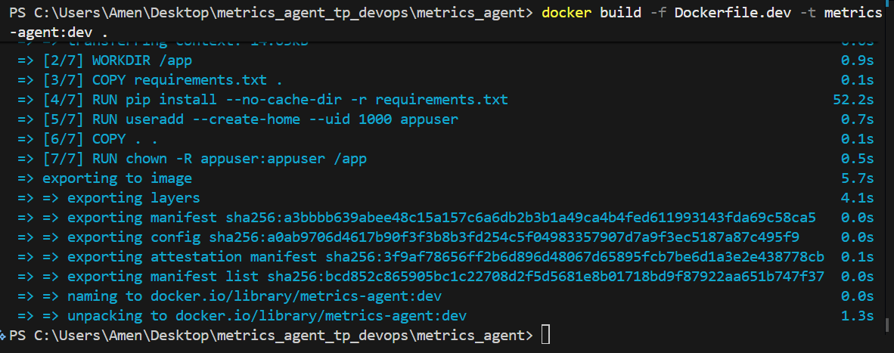

*Les 7 étapes du `Dockerfile.dev` : installation des dépendances (`pip install`), création de l'utilisateur `appuser`, copie du code et changement de propriétaire.*

Vérification de l'image créée :

```bash
docker images
```

**Résultat obtenu :**

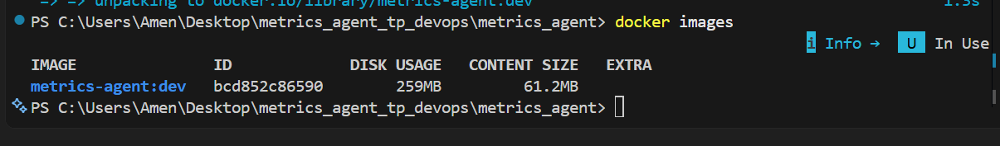

*L'image `metrics-agent:dev` (ID `bcd852c86590`) est présente localement.*

### 4.2 Lancer le conteneur et vérifier le rechargement à chaud

```bash
docker run --rm -p 8000:8000 --name test-metrics metrics-agent:dev
```

**Résultat obtenu :**

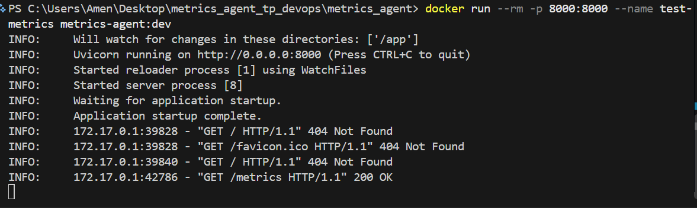

*Les lignes `Will watch for changes in these directories: ['/app']` et `Started reloader process` confirment que le mode `--reload` est actif. L'appel `GET /metrics` renvoie `200 OK` (les `404` sur `/` et `/favicon.ico` sont normaux : ces routes n'existent pas).*

### 4.3 Lancer tout l'environnement de développement avec Compose

Le fichier `docker-compose.override.yml` est appliqué **automatiquement** : il utilise `Dockerfile.dev` et monte `./app` et `./tests` en volume.

```bash
cp .env.example .env
docker compose up --build
```

L'API est disponible sur <http://localhost:8000> (documentation interactive sur `/docs`). Toute modification dans `app/` est prise en compte immédiatement.

### 4.4 Lancer les tests

```bash
docker run --rm metrics-agent:dev pytest -q
```

---

## 5. Lancer en production

L'image de production (`Dockerfile`) répond aux exigences suivantes :

| Exigence | Mise en œuvre |
| --- | --- |
| Build multi-stage | Étape `builder` (installation des dépendances) + image finale minimale |
| Dépendances d'exécution seulement | `requirements-prod.txt` (sans `pytest`) |
| Utilisateur non-root | `appuser` (UID 1000) |
| Healthcheck | `HEALTHCHECK` sur `/health` |
| Port exposé | `EXPOSE 8000` |
| Commande claire | `CMD ["uvicorn", "app.api:app", "--host", "0.0.0.0", "--port", "8000"]` |
| Image légère | `python:3.12-slim`, `--no-cache-dir`, `.dockerignore` (exclut `.git`, tests, `.env`, docs…) |

### 5.1 Construire l'image de production

```bash
docker build -f Dockerfile -t metrics-agent:prod .
```

**Résultat obtenu :**

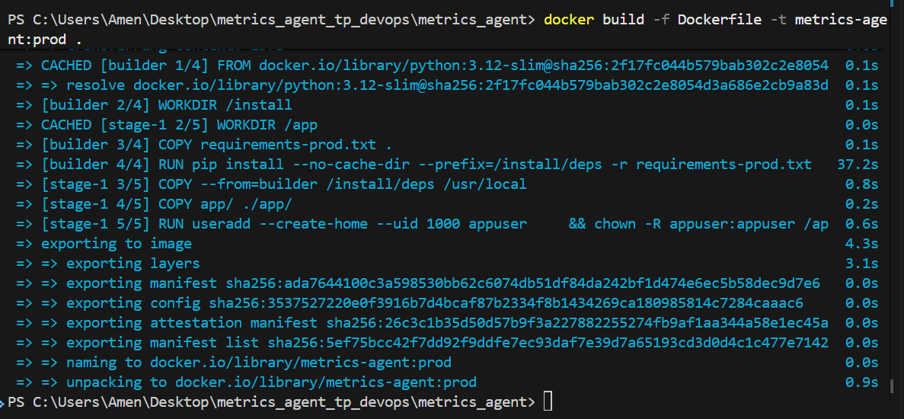

*Le build se fait en deux étapes : `builder` (installation des dépendances dans `/install/deps`) puis `stage-1` (copie des dépendances, du dossier `app/` seul, et création de l'utilisateur non-root).*

### 5.2 Lancer le conteneur et vérifier le healthcheck

```bash
docker run --rm -p 8000:8000 --name test-metrics-prod metrics-agent:prod
```

**Résultat obtenu :**

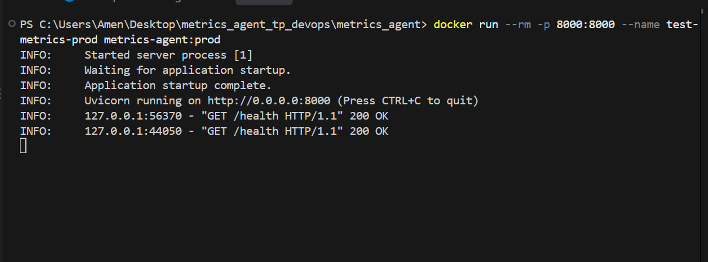

*Uvicorn démarre sans `--reload` ; les appels `GET /health` depuis `127.0.0.1` (le healthcheck Docker) répondent `200 OK`.*

Dans un second terminal :

```bash
docker ps
```

**Résultat obtenu :**

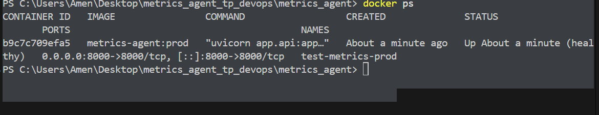

*Le statut `Up … (healthy)` prouve que le `HEALTHCHECK` fonctionne ; le port `8000` est publié sur l'hôte.*

### 5.3 Comparaison des images dev et prod

**Résultat obtenu :**

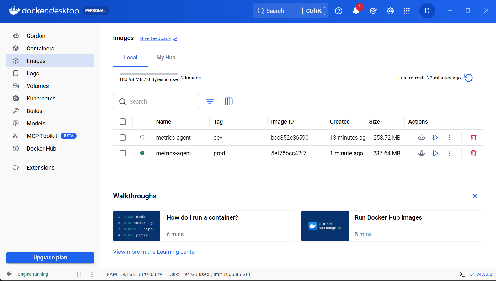

| Image | Taille |
| --- | --- |
| `metrics-agent:dev` | 258,72 Mo |
| `metrics-agent:prod` | 237,64 Mo |

*L'image de production est plus légère : elle ne contient ni `pytest`, ni `httpx`, ni les tests, ni les fichiers de configuration du dépôt.*

---

## 6. Orchestration avec Docker Compose

Le fichier `docker-compose.yaml` définit :

- un service **`api`** (image de production) qui publie le port `8000` sur l'hôte ;
- un service **`agent`** qui envoie ses métriques à `http://api:8000/metrics` via le réseau interne ;
- `env_file: .env` pour la configuration (aucune valeur sensible commitée) ;
- un réseau dédié **`metrics-net`** (driver `bridge`) ;
- un **healthcheck** sur l'API, réutilisé par `depends_on: condition: service_healthy` : l'agent ne démarre que lorsque l'API est prête ;
- `restart: unless-stopped` sur les deux services.

### 6.1 Build local et démarrage (production)

L'option `-f docker-compose.yaml` ignore l'override de développement et utilise donc le `Dockerfile` de production.

```bash
cp .env.example .env
docker compose -f docker-compose.yaml up --build -d
```

**Résultat obtenu :**

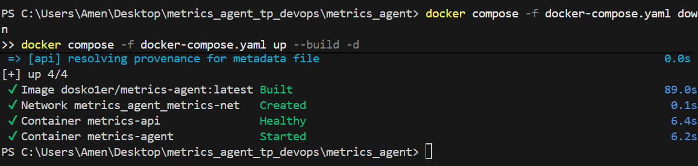

*Le réseau `metrics_agent_metrics-net` est créé, le conteneur `metrics-api` passe à l'état **Healthy**, puis `metrics-agent` démarre.*

### 6.2 Vérifier la communication agent → API

```bash
docker compose -f docker-compose.yaml logs --tail=20 agent
```

**Résultat obtenu :**

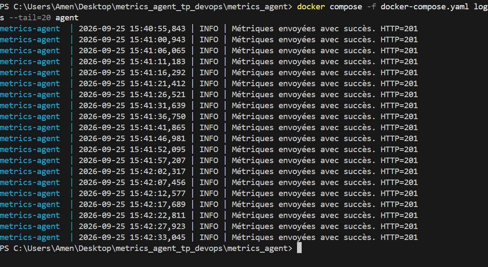

*Toutes les ~5 secondes (`COLLECTION_INTERVAL`), l'agent envoie ses métriques et reçoit `HTTP=201` : la communication entre les deux conteneurs via le réseau Docker fonctionne.*

### 6.3 Vérifier l'API depuis l'hôte

```bash
curl http://localhost:8000/health
curl http://localhost:8000/metrics/latest
```

<!--
CAPTURE À AJOUTER : résultat de ces deux commandes (ou page /docs dans le navigateur)

-->

### 6.4 Arrêter la stack

```bash
docker compose -f docker-compose.yaml down
```

---

## 7. Pipeline CI/CD

Fichier : [`.github/workflows/ci-cd.yml`](.github/workflows/ci-cd.yml)

### Déclenchement

- à chaque **`push`** sur `main` ;
- à chaque **`pull_request`** vers `main`.

### Étapes (dans l'ordre)

| # | Étape | Détail |
| --- | --- | --- |
| 1 | **Checkout** | `actions/checkout@v4` |
| 2 | **Préparation Python** | `actions/setup-python@v5` (3.12) + `pip install -r requirements.txt` |
| 3 | **Build** | `docker/build-push-action@v5` construit l'image de production (`push: false`) pour valider le `Dockerfile` |
| 4 | **Test** | `pytest -q` : le pipeline **échoue** si un test échoue |
| 5 | **Connexion Docker Hub** | `docker/login-action@v3` avec les secrets |
| 6 | **Push** | Publication avec les tags `latest` et `<SHA du commit>` |

Les étapes 5 et 6 ne s'exécutent que si l'événement est un **`push` sur `main`**, et uniquement si les étapes précédentes (dont les tests) ont réussi. Les pull requests ne font donc que build + test, sans publier.

### Secrets requis

À définir dans **Settings → Secrets and variables → Actions** du dépôt GitHub :

| Secret | Description |
| --- | --- |
| `DOCKERHUB_USERNAME` | Identifiant Docker Hub |
| `DOCKERHUB_TOKEN` | *Access token* Docker Hub (jamais le mot de passe) |

Aucun identifiant n'apparaît en clair dans le code, l'historique Git ou l'image.

<!--
CAPTURE À AJOUTER (optionnel) : page Settings → Secrets and variables → Actions (noms des secrets visibles, valeurs masquées)

-->

### Exécution du pipeline

**Résultat obtenu :**

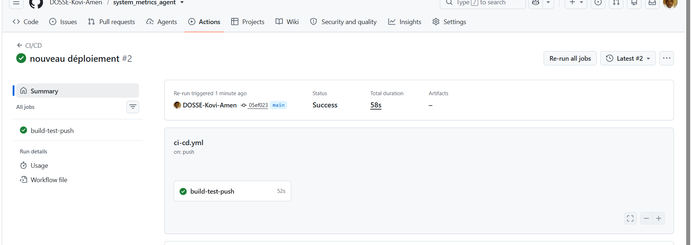

*Le workflow `CI/CD` (job `build-test-push`) est vert sur la branche `main` : build, tests et push se sont déroulés avec succès en moins d'une minute.*

---

## 8. Images Docker Hub

Dépôt public : **<https://hub.docker.com/r/dosko1er/metrics-agent>**

Le pipeline publie automatiquement l'image après chaque `push` réussi sur `main`.

**Résultat obtenu :**

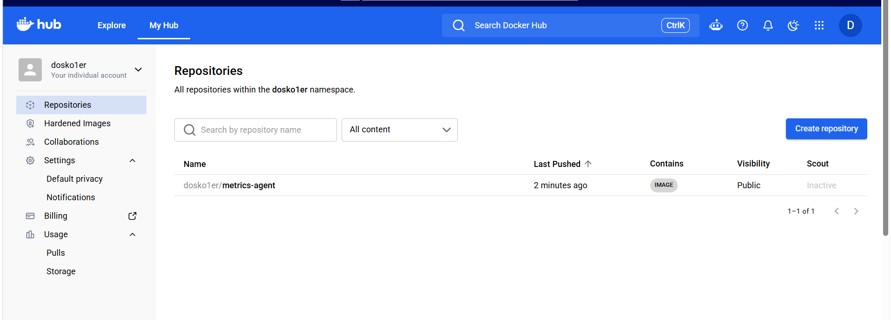

*Le dépôt `dosko1er/metrics-agent` est visible, public, et contient une image fraîchement publiée.*

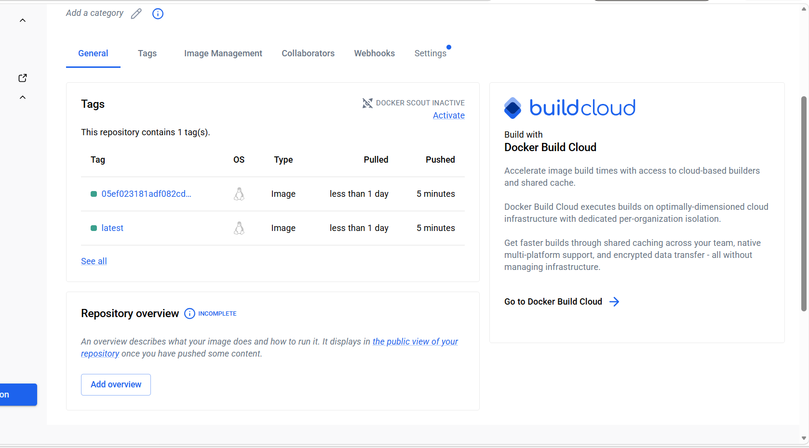

*Deux tags ont été poussés par le pipeline : `latest` et un tag correspondant au **SHA du commit** (`05ef023…`, le même commit que celui du pipeline vert).*

### Déploiement à partir des images publiées (sans code source)

Dans un dossier vide, il suffit de disposer de `docker-compose.yaml` et du `.env` (avec `DOCKERHUB_USERNAME=dosko1er`) :

```bash
docker compose -f docker-compose.yaml pull
docker compose -f docker-compose.yaml up -d --no-build
```

<!--
CAPTURE À AJOUTER : sortie de `docker compose pull` puis `docker compose ps`, avec l'image dosko1er/metrics-agent:latest téléchargée depuis Docker Hub

-->

---

## 9. Choix techniques et difficultés rencontrées

### Choix techniques

- **Image unique partagée entre `api` et `agent`** : les deux processus font partie de la même application et partagent code et dépendances. Seule la commande de démarrage diffère (`uvicorn …` pour l'API, `python -m app.agent` pour l'agent) et est définie par service dans le `docker-compose.yaml`. On évite ainsi de maintenir deux images quasi identiques, et le pipeline n'a qu'un seul build/push.
- **`python:3.12-slim` comme image de base** : bon compromis entre légèreté et compatibilité (les dépendances comme `psutil` s'installent sans compilation, ce qui est plus délicat avec `alpine`).
- **Build multi-stage** : les dépendances sont installées dans une étape `builder`, puis seul le résultat est copié dans l'image finale (sans cache `pip`).
- **Deux fichiers de dépendances** : `requirements.txt` (avec `pytest` et `httpx`, pour le développement et la CI) et `requirements-prod.txt` (exécution uniquement), afin que `pytest` ne soit jamais embarqué en production.
- **Healthcheck sans `curl`** : il interroge `/health` avec `urllib.request` (bibliothèque standard), ce qui évite d'alourdir l'image.
- **Réseau dédié et `depends_on` conditionné** : l'agent attend que l'API soit `healthy` avant de démarrer, pour éviter des échecs d'envoi au lancement.
- **Override de développement** : `docker-compose.override.yml` permet de basculer en mode dev (`Dockerfile.dev`, volumes, `--reload`) sans modifier le fichier de production.
- **Tags `latest` + SHA du commit** : `latest` pour le déploiement simple, le SHA pour la traçabilité et le retour arrière.

### Difficultés rencontrées

- **Outil `uptime` manquant** : les images `slim` ne contiennent pas `procps`, nécessaire au collecteur pour lire la charge système. Le paquet a été ajouté (avec nettoyage de `/var/lib/apt/lists`) dans `Dockerfile` et `Dockerfile.dev`.
- **`pytest` dans l'image de production** : il se trouvait d'abord dans les dépendances de production ; il a été retiré de `requirements-prod.txt` et conservé dans `requirements.txt` (commits `ddf0afa` et `55fbf51`).
- **`127.0.0.1` entre conteneurs** : l'agent ne pouvait pas joindre l'API avec l'adresse locale ; il faut utiliser le nom du service Docker (`http://api:8000/metrics`).
- **Sécurité des identifiants** : utilisation de secrets GitHub, d'un *access token* Docker Hub, et d'un `.env` ignoré par Git et exclu des images via `.dockerignore`.

---

## 10. Récapitulatif des preuves de fonctionnement

| Exigence du TP | Preuve |
| --- | --- |
| `Dockerfile.dev` fonctionnel + hot-reload | [Build](docs/images/01-build-dev.png) · [Image](docs/images/02-images-dev.png) · [Run + reload](docs/images/03-run-dev-hot-reload.png) |
| `Dockerfile` de production (multi-stage, non-root, healthcheck) | [Build multi-stage](docs/images/04-build-prod-multistage.png) · [Run `/health`](docs/images/05-run-prod-health.png) · [`healthy`](docs/images/07-docker-ps-healthy.png) · [Tailles](docs/images/06-docker-desktop-dev-vs-prod.png) |
| `docker-compose.yaml` (services, réseau, dépendances) | [Compose up](docs/images/08-compose-up.png) · [Logs agent `HTTP=201`](docs/images/09-compose-logs-agent.png) |
| Pipeline GitHub Actions vert | [Pipeline](docs/images/10-github-actions-success.png) |
| Publication Docker Hub (`latest` + SHA) | [Dépôt](docs/images/11-dockerhub-repositories.png) · [Tags](docs/images/12-dockerhub-tags.png) |

---

*TP « Éléments du DevOps » — Master — Conteneurisation et CI/CD.*
